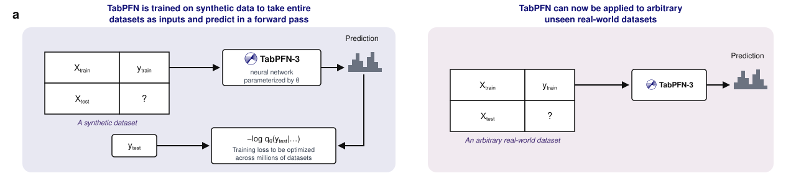
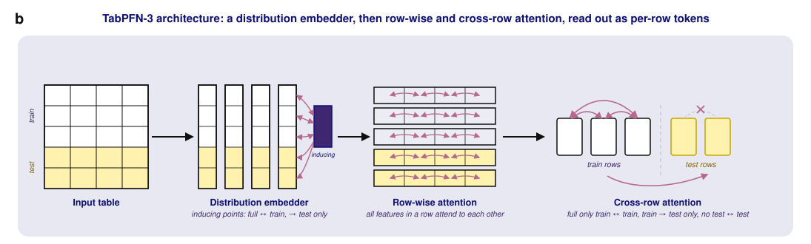

# TabPFN

[](https://badge.fury.io/py/tabpfn)
[](https://pepy.tech/project/tabpfn)
[](https://discord.gg/BHnX2Ptf4j)
[](https://priorlabs.ai/docs)
[](https://colab.research.google.com/github/PriorLabs/TabPFN/blob/main/examples/notebooks/TabPFN_Demo_Local.ipynb)
[](https://pypi.org/project/tabpfn/)





## Quick Start

### Interactive Notebook Tutorial
> [!TIP]
>
> Dive right in with our interactive Colab notebook! It's the best way to get a hands-on feel for TabPFN, walking you through installation, classification, and regression examples.
>
> [](https://colab.research.google.com/github/PriorLabs/TabPFN/blob/main/examples/notebooks/TabPFN_Demo_Local.ipynb)

### Installation
```bash
pip install tabpfn
```

TabPFN supports Python 3.10+. `pip install tabpfn` installs a compatible
PyTorch build automatically. If you want a smaller CPU-only install, need a
PyTorch build for a specific accelerator or CUDA version, or want platform
notes for Windows and WSL, choose the matching command from the
[PyTorch installation selector](https://pytorch.org/get-started/locally/) before
installing TabPFN.

Note: For best performance on Apple Silicon/MPS, consider installing a PyTorch
version after the nightly "2.13.0.dev20260510". This enables flash attention
without relying on MLX (the latter requires a GPU-CPU-GPU roundtrip).


### Basic Usage

> ⚡ **GPU Recommended**:
> For optimal performance, use a GPU (even older ones with ~8GB VRAM work well; 16GB needed for some large datasets).
> On CPU, only moderate datasets are feasible (the default TabPFN-3 allows up to 5000 samples; older versions up to 1000).
> No GPU? Use our free hosted inference via [TabPFN Client](https://github.com/PriorLabs/tabpfn-client).

To use our default TabPFN-3 model:

```python
from tabpfn import TabPFNClassifier, TabPFNRegressor

clf = TabPFNClassifier()
clf.fit(X_train, y_train)  # downloads checkpoint on first use
predictions = clf.predict(X_test)

reg = TabPFNRegressor()
reg.fit(X_train, y_train)  # downloads checkpoint on first use
predictions = reg.predict(X_test)
```

To use other model versions (e.g. the previous default, TabPFN-2.6):

```python
from tabpfn import TabPFNClassifier, TabPFNRegressor
from tabpfn.constants import ModelVersion

classifier = TabPFNClassifier.create_default_for_version(ModelVersion.V2_6)
regressor = TabPFNRegressor.create_default_for_version(ModelVersion.V2_6)
```

For complete examples, see the [tabpfn_for_binary_classification.py](https://github.com/PriorLabs/TabPFN/tree/main/examples/tabpfn_for_binary_classification.py), [tabpfn_for_multiclass_classification.py](https://github.com/PriorLabs/TabPFN/tree/main/examples/tabpfn_for_multiclass_classification.py), and [tabpfn_for_regression.py](https://github.com/PriorLabs/TabPFN/tree/main/examples/tabpfn_for_regression.py) files.

## TabPFN Ecosystem

Choose the right TabPFN implementation for your needs:

- **[TabPFN Client](https://github.com/priorlabs/tabpfn-client)**
  Simple API client for using TabPFN via cloud-based inference.

- **[TabPFN Extensions](https://github.com/priorlabs/tabpfn-extensions)**
  Community extensions and integrations, including:

  -  **`interpretability`**: Gain insights with SHAP-based explanations, feature importance, and selection tools.
  -  **`unsupervised`**: Tools for outlier detection and synthetic tabular data generation.
  -  **`embeddings`**: Extract and use TabPFN's internal learned embeddings for downstream tasks or analysis.
  -  **`many_class`**: Handle multi-class classification problems that exceed TabPFN's built-in class limit.

  To install:
  ```bash
  pip install tabpfn-extensions
  ```

- **[TabPFN (this repo)](https://github.com/priorlabs/tabpfn)**
  Core implementation for fast and local inference with PyTorch and CUDA support.

- **[TabPFN UX](https://ux.priorlabs.ai)**
  No-code graphical interface to explore TabPFN capabilities—ideal for business users and prototyping.

## License

The TabPFN-2.5, TabPFN-2.6, and TabPFN-3 model weights are released under non-commercial licenses (TabPFN-3 [license](https://huggingface.co/Prior-Labs/tabpfn_3/blob/main/LICENSE); see the [Models page](https://docs.priorlabs.ai/models#tabpfn-model-license) for prior releases). TabPFN-3 is used by default.

The code and TabPFN-2 model weights are licensed under Prior Labs License (Apache 2.0 with additional attribution requirement): [here](LICENSE). To use the v2 model weights, instantiate your model as follows:

```python
from tabpfn import TabPFNRegressor
from tabpfn.constants import ModelVersion

tabpfn_v2 = TabPFNRegressor.create_default_for_version(ModelVersion.V2)
```

## Enterprise & Production

For high-throughput or massive-scale production environments, we offer an **Enterprise Edition** with the following capabilities:
-   **Fast Inference Mode**: A proprietary distillation engine that converts TabPFN into a compact MLP or tree ensemble, delivering orders-of-magnitude lower latency for real-time applications.
-   **Commercial Support**: Includes a Commercial Enterprise License for production use-cases, dedicated integration support, and access to private high-speed inference engines.

**To learn more or request a commercial license, please contact us at [sales@priorlabs.ai](mailto:sales@priorlabs.ai).**


## Join Our Community

We're building the future of tabular machine learning and would love your involvement:

1. **Connect & Learn**:
   - Join our [Discord Community](https://discord.gg/VJRuU3bSxt)
   - Read our [Documentation](https://priorlabs.ai/docs)
   - Check out [GitHub Issues](https://github.com/priorlabs/tabpfn/issues)

2. **Contribute**:
   - Report bugs or request features
   - Share your research and use cases
   - Submit pull requests — **please open an issue first** (see below)

3. **Stay Updated**: Star the repo and join Discord for the latest updates

> [!IMPORTANT]
> **Open an issue before starting work on a PR.**
>
> If there's a feature you'd like to add or a bug you've found, please [open a GitHub issue](https://github.com/priorlabs/tabpfn/issues) with a high-level sketch of your plan. This lets us give feedback on the approach *before* you invest the effort, saving everyone time and increasing the chance your change lands.
>
> There are many reasons a PR may not be mergeable — design fit, scope, compatibility, planned refactors, etc. — and these are often hard to spot from the outside, especially for a first-time contributor.

## Citation

You can read our paper explaining TabPFNv2 [here](https://doi.org/10.1038/s41586-024-08328-6), and model reports for [TabPFN-2.5](https://arxiv.org/abs/2511.08667) and [TabPFN-3](https://arxiv.org/abs/2605.13986).

<details>
<summary><b>BibTeX</b></summary>

```bibtex
@misc{grinsztajn2026tabpfn3technicalreport,
      title={TabPFN-3: Technical Report}, 
      author={Léo Grinsztajn and Klemens Flöge and Oscar Key and Felix Birkel and Philipp Jund and Brendan Roof and Mihir Manium and Shi Bin Hoo and Magnus Bühler and Anurag Garg and Dominik Safaric and Jake Robertson and Benjamin Jäger and Simone Alessi and Adrian Hayler and Vladyslav Moroshan and Lennart Purucker and Philipp Singer and Alan Arazi and Julien Siems and Jan Hendrik Metzen and Georg Grab and Nick Erickson and Siyuan Guo and Eliott Kalfon and Simon Bing and David Salinas and Clara Cornu and Lilly Charlotte Wehrhahn and Diana Kriuchkova and Kursat Kaya and Lydia Sidhoum and Marie Salmon and Jerry Chen and Madelon Hulsebos and Yann LeCun and Samuel Müller and Bernhard Schölkopf and Sauraj Gambhir and Noah Hollmann and Frank Hutter},
      year={2026},
      eprint={2605.13986},
      archivePrefix={arXiv},
      primaryClass={cs.LG},
      url={https://arxiv.org/abs/2605.13986}, 
}

@misc{grinsztajn2025tabpfn,
  title={TabPFN-2.5: Advancing the State of the Art in Tabular Foundation Models},
  author={Léo Grinsztajn and Klemens Flöge and Oscar Key and Felix Birkel and Philipp Jund and Brendan Roof and
          Benjamin Jäger and Dominik Safaric and Simone Alessi and Adrian Hayler and Mihir Manium and Rosen Yu and
          Felix Jablonski and Shi Bin Hoo and Anurag Garg and Jake Robertson and Magnus Bühler and Vladyslav Moroshan and
          Lennart Purucker and Clara Cornu and Lilly Charlotte Wehrhahn and Alessandro Bonetto and
          Bernhard Schölkopf and Sauraj Gambhir and Noah Hollmann and Frank Hutter},
  year={2025},
  eprint={2511.08667},
  archivePrefix={arXiv},
  url={https://arxiv.org/abs/2511.08667},
}

@article{hollmann2025tabpfn,
 title={Accurate predictions on small data with a tabular foundation model},
 author={Hollmann, Noah and M{\"u}ller, Samuel and Purucker, Lennart and
         Krishnakumar, Arjun and K{\"o}rfer, Max and Hoo, Shi Bin and
         Schirrmeister, Robin Tibor and Hutter, Frank},
 journal={Nature},
 year={2025},
 month={01},
 day={09},
 doi={10.1038/s41586-024-08328-6},
 publisher={Springer Nature},
 url={https://www.nature.com/articles/s41586-024-08328-6},
}

@inproceedings{hollmann2023tabpfn,
  title={TabPFN: A transformer that solves small tabular classification problems in a second},
  author={Hollmann, Noah and M{\"u}ller, Samuel and Eggensperger, Katharina and Hutter, Frank},
  booktitle={International Conference on Learning Representations 2023},
  year={2023}
}
```

</details>


## Usage Tips

- **Use batch prediction mode**: Each `predict` call recomputes the training set. Calling `predict` on 100 samples separately is almost 100 times slower and more expensive than a single call. If the test set is very large, split it into chunks of 1000 samples each.
- **Avoid data preprocessing**: Do not apply data scaling or one-hot encoding when feeding data to the model.
- **Use a GPU**: TabPFN is slow to execute on a CPU. Ensure a GPU is available for better performance.
- **Mind the dataset size**: TabPFN works best on datasets within its recommended size limits. The current default (**TabPFN-3**) supports up to **1,000,000 × 200**, **100,000 × 2,000**, or **1,000 × 20,000** (rows × features) — larger feature counts trade off against row capacity. See the [Models page](https://docs.priorlabs.ai/models) for the limits of other checkpoints.

## ❓ FAQ

### **Usage & Compatibility**

<details>
<summary><b>Q: What dataset sizes work best with TabPFN?</b></summary>

Recommended row and feature limits vary by checkpoint — see the [Models page](https://docs.priorlabs.ai/models) for the per-release limits. As a quick reference, the current default (**TabPFN-3**) supports up to **1,000,000 × 200**, **100,000 × 2,000**, or **1,000 × 20,000** (rows × features); larger feature counts trade off against row capacity. The previous default (**TabPFN-2.6**) is recommended for up to **100,000 rows** and **2,000 features**. If your dataset exceeds the recommended limits for your checkpoint, you can subsample, set `ignore_pretraining_limits=True` to push past the size guardrail, or upgrade to a release with a higher limit.

</details>

<details>
<summary><b>Q: Why can't I use TabPFN with Python 3.9?</b></summary>

TabPFN requires **Python 3.10+** due to newer language features. Compatible versions: **3.10, 3.11, 3.12, 3.13, 3.14**.

</details>

### **Installation & Setup**

<details>
<summary><b>Q: How do I get access to TabPFN-2.5 / TabPFN-2.6 / TabPFN-3?</b></summary>

On first use, TabPFN will automatically open a browser window where you can log in via [PriorLabs](https://ux.priorlabs.ai) and accept the license terms. Your authentication token is cached locally so you only need to do this once.

**For headless / CI environments** where a browser is not available, visit [https://ux.priorlabs.ai](https://ux.priorlabs.ai), go to the **License** tab to accept the license, and then set the `TABPFN_TOKEN` environment variable with a token obtained from your account.

If access via the browser-based flow is not an option for you, please contact us at [`sales@priorlabs.ai`](mailto:sales@priorlabs.ai).

</details>

<details>
<summary><b>Q: How do I use TabPFN without an internet connection?</b></summary>

TabPFN automatically downloads model weights when first used. For offline usage:

**Using the Provided Download Script**

If you have the TabPFN repository, you can use the included script to download all models (including ensemble variants):

```bash
# After installing TabPFN
python scripts/download_all_models.py
```

This script will download the main classifier and regressor models, as well as all ensemble variant models to your system's default cache directory.

**Manual Download**

1. Download the model files manually from HuggingFace:
   - Classifier: [tabpfn-v3-classifier-v3_default.ckpt](https://huggingface.co/Prior-Labs/tabpfn_3/blob/main/tabpfn-v3-classifier-v3_default.ckpt)
   - Regressor: [tabpfn-v3-regressor-v3_default.ckpt](https://huggingface.co/Prior-Labs/tabpfn_3/blob/main/tabpfn-v3-regressor-v3_default.ckpt)

2. Place the file in one of these locations:
   - Specify directly: `TabPFNClassifier(model_path="/path/to/model.ckpt")`
   - Set environment variable: `export TABPFN_MODEL_CACHE_DIR="/path/to/dir"` (see environment variables FAQ below)
   - Default OS cache directory:
     - Windows: `%APPDATA%\tabpfn\`
     - macOS: `~/Library/Caches/tabpfn/`
     - Linux: `~/.cache/tabpfn/`

</details>

<details>
<summary><b>Q: I'm getting a <code>pickle</code> error when loading the model. What should I do?</b></summary>

Try the following:
- Download the newest version of tabpfn `pip install tabpfn --upgrade`
- Ensure model files downloaded correctly (re-download if needed)

</details>

<details>
<summary><b>Q: What environment variables can I use to configure TabPFN?</b></summary>

TabPFN uses Pydantic settings for configuration, supporting environment variables and `.env` files:

**Authentication:**
- `TABPFN_TOKEN`: Provide a PriorLabs authentication token directly (useful for headless/CI environments). Obtain one from [https://ux.priorlabs.ai](https://ux.priorlabs.ai).
- `TABPFN_NO_BROWSER`: Set to disable automatic browser-based login (e.g. in environments where opening a browser is undesirable).

**Model Configuration:**
- `TABPFN_MODEL_CACHE_DIR`: Custom directory for caching downloaded TabPFN models (default: platform-specific user cache directory)
- `TABPFN_ALLOW_CPU_LARGE_DATASET`: Allow running TabPFN on CPU above the per-model sample limit (5000 for the default TabPFN-3, 1000 for older versions). Set to `true` to override the CPU limitation. Note: large datasets can still be slow on CPU!
- `TABPFN_MPS_MEMORY_FRACTION`: Fraction of recommended max MPS memory to allow on Apple Silicon (default: `0.7`). Used to prevent macOS system crashes; set before importing TabPFN. Values above `1.0` are not recommended.
- `TABPFN_MAX_BATCHED_TEST_ROWS`: Maximum number of test rows fed through the model in a single forward pass during cached (`fit_mode="fit_with_cache"`) inference (default: `32768`). Larger test sets are split into independent chunks of at most this size and concatenated, bounding peak memory. Test rows are conditionally independent given the KV cache, so chunking is mathematically equivalent — results may still differ slightly due to floating-point non-associativity (see [#800](https://github.com/PriorLabs/TabPFN/issues/800#issuecomment-4903444425)). Performance should be close to optimal at the default of `32768`: the hardware is already saturated at that chunk size and, since the computations are independent, larger chunks bring no speedup. Set to `0` to disable chunking.

**PyTorch Settings:**
- `PYTORCH_CUDA_ALLOC_CONF`: PyTorch CUDA memory allocation configuration to optimize GPU memory usage (default: `max_split_size_mb:512`). See [PyTorch CUDA documentation](https://docs.pytorch.org/docs/stable/notes/cuda.html#optimizing-memory-usage-with-pytorch-cuda-alloc-conf) for more information.
- If you experience crashes on Windows with the error message containing `Windows fatal exception: code 0xc000001d`, try to set `ONEDNN_MAX_CPU_ISA=AVX512_CORE_FP16`. This is likely an upstream pytorch/oneDNN bug.

Example:
```bash
export TABPFN_MODEL_CACHE_DIR="/path/to/models"
export TABPFN_ALLOW_CPU_LARGE_DATASET=true
export PYTORCH_CUDA_ALLOC_CONF="max_split_size_mb:512"
```

Or simply set them in your `.env`

</details>

<details>
<summary><b>Q: How do I save and load a trained TabPFN model?</b></summary>

Use `save_fitted_tabpfn_model` to persist a fitted estimator and reload
it later with `load_fitted_tabpfn_model` (or the corresponding
`load_from_fit_state` class methods).

```python
from tabpfn import TabPFNRegressor
from tabpfn.model_loading import (
    load_fitted_tabpfn_model,
    save_fitted_tabpfn_model,
)

# Train the regressor on GPU
reg = TabPFNRegressor(device="cuda")
reg.fit(X_train, y_train)
save_fitted_tabpfn_model(reg, "my_reg.tabpfn_fit")

# Later or on a CPU-only machine
reg_cpu = load_fitted_tabpfn_model("my_reg.tabpfn_fit", device="cpu")
```

To store just the foundation model weights (without a fitted estimator) use
``save_tabpfn_model(reg, "my_tabpfn.ckpt")`` (imported from ``tabpfn.model_loading``). This merely saves a
checkpoint of the pre-trained weights so you can later create and fit a fresh
estimator. Reload the checkpoint with ``load_model_criterion_config``.

</details>

### **Performance & Limitations**

<details>
<summary><b>Q: Can TabPFN handle missing values?</b></summary>

**Yes!**

</details>

<details>
<summary><b>Q: How can I improve TabPFN's performance?</b></summary>

Best practices:
- Feature engineering: Add domain-specific features to improve model performance
- See the [Improving Performance guide](https://docs.priorlabs.ai/improving-performance) for the full escalation path

Not effective:
- Adapt feature scaling
- Convert categorical features to numerical values (e.g., one-hot encoding)

</details>

<details>
<summary><b>Q: What are the different checkpoints on <a href="https://huggingface.co/Prior-Labs">Hugging Face</a>?</b></summary>

Each TabPFN release publishes a default classification and regression checkpoint. Some releases also publish a handful of experimental variants — these aren't guaranteed to exist for every release. We recommend starting with the defaults; the variants are experimental and worse on average. When present, they can be used as part of an ensembling or hyperparameter optimization system, or tried out manually. Their name suffixes refer to what we expect them to be good at.

</details>

---

Built with ❤️ by [Prior Labs](https://priorlabs.ai) - Copyright (c) 2026 Prior Labs GmbH
